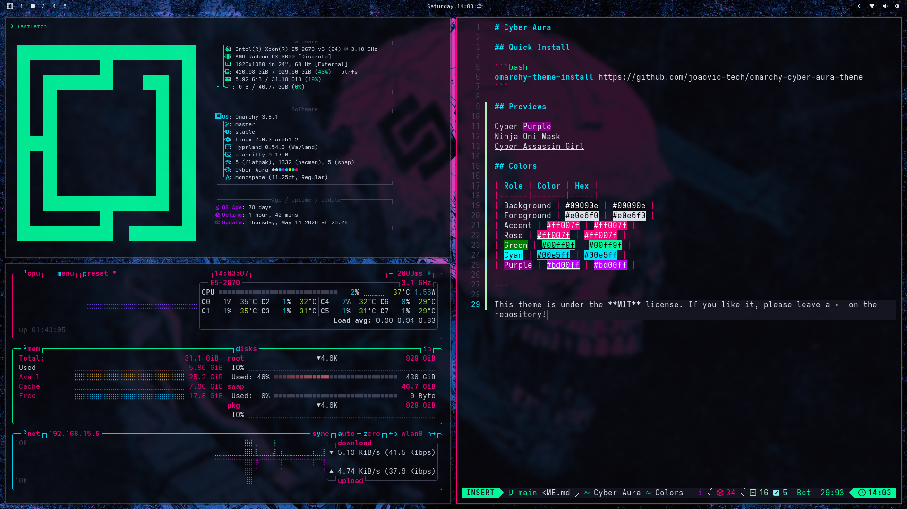
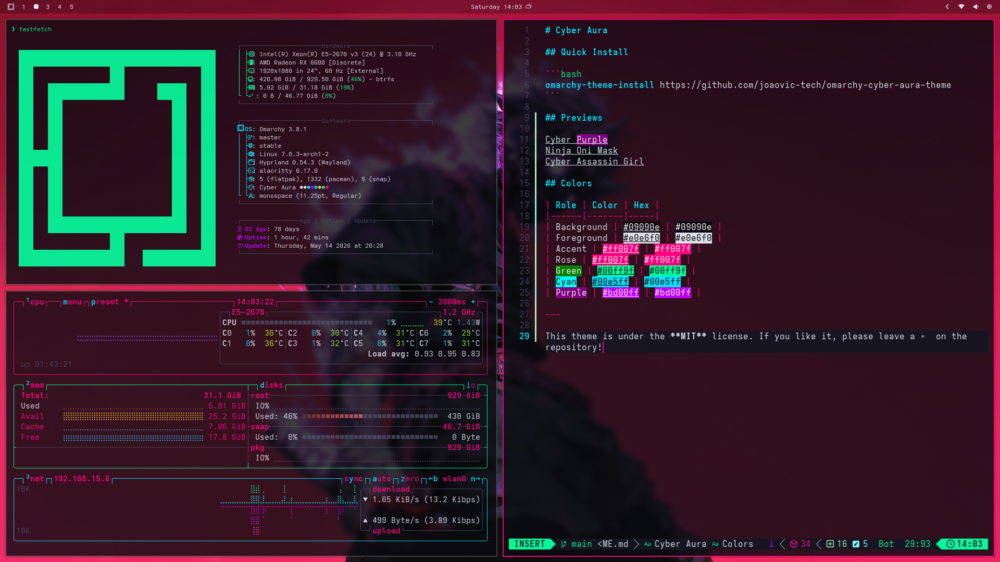
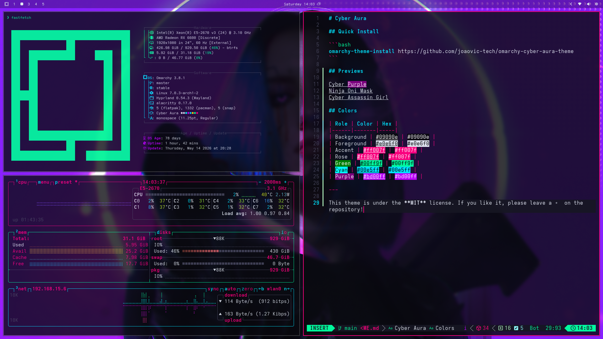

# Cyber Aura

## Quick Install

```bash
omarchy-theme-install https://github.com/joaovic-tech/omarchy-cyber-aura-theme
```

## Previews





## Colors

| Role | Color | Hex |
|------|-------|-----|
| Background |  | `#09090e` |
| Foreground |  | `#e0e6f0` |
| Accent |  | `#ff007f` |
| Rose |  | `#ff007f` |
| Green |  | `#00ff9f` |
| Cyan |  | `#00e5ff` |
| Purple |  | `#bd00ff` |

---

This theme is under the **MIT** license. If you like it, please leave a ⭐ on the repository!
